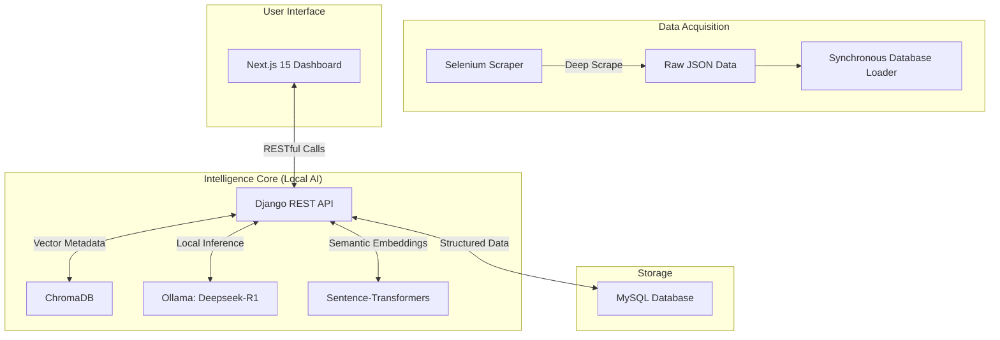

# Document Intelligence Platform

A high-performance, full-stack intelligence platform for book data analysis. It utilizes **Retrieval-Augmented Generation (RAG)** to enable natural language conversations with a library of books, powered by a 100% local and private AI pipeline.

---

## 🏗 System Architecture



---

## 🚀 Key Features

- **Local-First AI Integration**: Utilizes **Ollama** with the **Deepseek-R1** model for zero-cost, private AI insights and Q&A.
- **Selective Retrieval (RAG)**: Implements semantic search across book descriptions using `all-MiniLM-L6-v2` and **ChromaDB**.
- **Automated Book Forensics**: Generates summaries, genre classification, and sentiment analysis automatically upon book ingestion.
- **Deep Web Scraping**: Advanced Selenium engine that visits industrial catalog pages to harvest high-resolution cover art and technical metadata.
- **Glassmorphism UI**: A premium, responsive dark-mode dashboard built for professional research and analysis.

---

## 🛠 Setup & Installation

### Prerequisites
- Python 3.10+
- Node.js 18+
- MySQL Server
- [Ollama](https://ollama.com/) (Must be installed and running)

### 1. AI Model Setup
Ensure Ollama is running, then pull the required model:
```bash
ollama pull deepseek-r1:latest
```

### 2. Backend Environment
Navigate to `backend/` and initialize the environment:
```bash
# Install dependencies
pip install -r requirements.txt

# Run Database Migrations
python manage.py makemigrations
python manage.py migrate

# Start the API Server
python manage.py runserver
```

### 3. Data Ingestion (Scraping)
To populate the library with 40 intelligence-ready books:
```bash
# Run the scraper
python books/scraper/scrape_books.py

# Load data into the database and initialize RAG index
python books/scraper/load_to_db.py
```

### 4. Frontend Dashboard
Navigate to `frontend/` and start the interface:
```bash
npm install
npm run dev
```

---

## 📄 API Surface

| Endpoint | Method | Description |
|----------|--------|-------------|
| `/api/books/` | GET | List all books with AI-generated metadata. |
| `/api/books/{id}/` | GET | Retrieve full forensics for a single book. |
| `/api/books/{id}/recommendations/` | GET | Semantic neighbors based on vector similarity. |
| `/api/books/ask/` | POST | Context-aware Q&A against the book library. |

---

## 🔧 Technical Differentiators
- **Hybrid Search**: Combines traditional MySQL queries with high-dimensional vector search.
- **Synchronous Re-indexing**: Custom stability logic to ensure data integrity during bulk uploads.
- **Zero API Dependency**: 100% of the AI intelligence runs locally on your machine.

---
**Built for the Ergosphere Solutions Document Intelligence Internship.**

